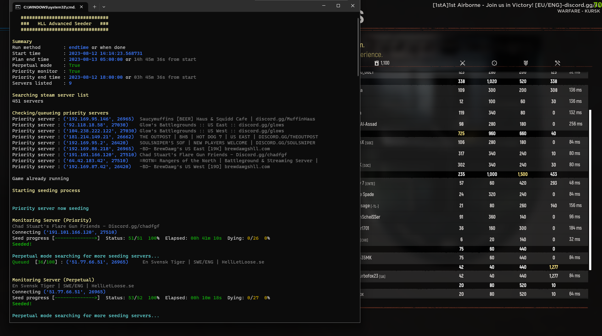

# 

Advanced, customizable, seeding script for Hell Let Loose.

Makes use of and credit to [KtodaZ](https://github.com/KtodaZ/) for batch scripts and scheduled task XML.



## Features

- Schedule a specific time to wake your computer and start the seed script `setup.bat`
- Seed multiple servers in a specific order
- Define priority servers by server name keywords or by specific IP
- Monitors and switches servers once each hits 50 pop
- Perpetual seeding mode
    - Searches the steam server list for additional seeding servers once it's done with your priority servers
    - Checks for servers matching criteria:
        - 8-50 pop
        - No password
        - Name does not contain keywords (HLL Official, Event, Training, CN, FR)
        - Max players is 100 (a real server, not bob the builder)
    - Help out the rest of the HLL community!
- Detects when a server is dying rather than seeding (server pop drops by half) and moves on
- Detects when you are no longer in the server's player list for whatever reason (usually idle kick) and moves on
- Detects when the game crashed and relaunches the game to keep seeding
- Multiple seeding methods
    - `endtime` Stops and closes the game at the specified time or when done*
    - `minutes` Stops and closes the game after _N_ minutes or when done*
    - \* when done with defined list. long seed times more relevant for perpetual mode
- Closes the game when done seeding

## Setup and Install

1. Install the latest Python 3.x
    - https://www.python.org/downloads/
    - On the installer be sure to check `Add Python to PATH`
2. Install required python packages
    - Use `requirements_pip_install.bat` as the quickest/easiest option
    - Alternatively, use command prompt, cd to the project, and run `pip install -r requirements.txt` manually
3. Open `seeding.yaml` to configure script settings and servers to seed
    - Most default values should be fine as is though can be tweaked however you want
    - Most relevant properties you'll probably want to change:
        - `seeding.method`
        - `priority.servers`
        - `priority.monitor_enabled`
        - `check_idle_kick` and `player_name`
        - `perpetual_mode.enabled`
4. Run `setup.bat` to create a scheduled task that will wake up the computer and run the seeding script

To verify a task is scheduled use `verify.bat`.

To uninstall a scheduled task use `uninstall.bat`.

To manually start the script again use `runGame.bat` (this is what the scheduled task calls).

## How it works

The python script uses A2S or the Valve Protocol to query game servers
for their current player count and current player names joined.

https://developer.valvesoftware.com/wiki/Server_queries

It also uses the Valve Master Server Query Protocol to search for all current Hell Let Loose servers
to search for ones that match your priority server criteria or for perpetual mode.

https://developer.valvesoftware.com/wiki/Master_Server_Query_Protocol

Check out the account running this almost 24/7! 

[SodiumEnglish](https://steamcommunity.com/profiles/76561199503883512/) with more than 1500 hours of just seeding

## Q & A

### Why would I want to help other community servers? (perpetual mode)

Seeding servers can be exhausting and painful! An extra digit is always helpful.

When all your priority servers are seeded or waiting to start seeding, use the idle time otherwise to help out the rest
of the community.

The more populated servers there are, the better it is for the longevity of the game.

### Is there any risk running this?

It should be very, very, low.

At worst, a server may ban you for language/country rules.
For example, this happened to me in perpetual mode for random french servers requiring players to be "FR Only".
I have since added FR to the perpetual ignore terms.

<details>
<summary>The script does not interact with or give an advantage to any form of gameplay.</summary>
<br>

> The script can do the following:
> 
> - Use the `steam://` protocol to start steam, launch the game, and connect to servers
> - Use windows commands to check if Steam, HLL, and related processes are running
> - Use windows commands to kill the game or the crash window
> - Uses Valve A2S to query realtime server info and players
> - Uses Valve MSQP to query for all current servers
> - Saves screenshots locally when the game crashes or to capture server disconnect messages (idle kick, lost connection, ban, etc.)
> 
> The script **does not**:
> 
> - Interact with the game with mouse clicks, typing, or any kind of input
> - Provide any kind of gameplay advantage in any way
> 
> When the script joins a server, it is still up to you to manually join a side, build garrys, etc. if you choose to.

</details>


## Potential usages

### I want to... seed and monitor my priority servers when they start seeding and also help seed other community servers

The `seeding.yaml` by default is configured for this behavior.

It will go back and forth between priority, higher priority, and random community servers as necessary.

With `priority.monitor_enabled` the script will constantly check your priority servers and
jump back to them if the player count drops or they start seeding whenever that happens.

### I want to... only seed and monitor my priority servers and nothing else

Disable `perpetual_mode.enabled` and the script will only care about your configured priority servers.

### I want to... run the script 24/7

Using the task schedule start time, configure the `seeding.endtime` to a time shortly before that.

For example:

- `setup.bat` scheduled start of `6:00:00` or 6 AM.
- `seeding.yaml` scheduled end time of `5:45 am`
- Assuming priority monitor and/or perpetual mode are enabled, the script will be seeding servers almost endlessly

### I want to... run multiple scripts and accounts

Of course you would need multiple devices and script instances.

Default settings should work for this though you may need to tweak them depending on the number of accounts.

There are also mitigations (`priority.min_players`, `seeded_player_variability`, and `perpetual_mode` random method) to
prevent every account from jumping
to the next server all at the same time. These options will need to be tweaked/staggered for each instance for many
instances.

Note: `min_players` value of 1 is nearly the same as 0 since the player count will be including yourself.
Requires 1 person in order to join at first but if they leave, the seeding account will not move on.

## Troubleshooting

### The game starts, but the script never joines a game, it's just stuck on Launching Game
Solution: A process is not running that is required for the application to determine if the game server is ready to be joined
- One of these could be your Steam Overlay. If it is disabled in your setttings, you can remove it from the list of processes in `seeding.yaml`. Example:
```
misc_game_processes:
  - "GameOverlayUI.exe" # Remove/comment this one if your Steam Overlay is disabled
  - "HLL_BugReportUploader.exe"
  - "CrashReportClient.exe"
```